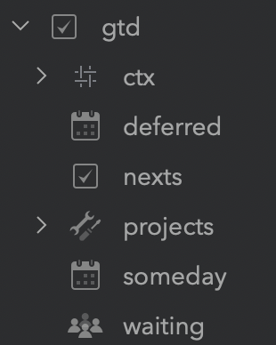

# GTD Brief generator from Bear notes

Generates (printer-friendly) GTD brief from (specially-tagged) [Bear](https://bear.app/) notes. Uses [pybear](https://github.com/redspider/pybear) for accessing the Bear SQLite DB directly. Assumed tags tree looks like this:

```
#gtd/
  ctx/
    05-home
    ...
    20-errand
    30-work
    ...
    shops/
    meetings/
  ...
  nexts
  waiting
  deferred
  someday
  projects/
```

Only contexts named as `ctx/{dd}-{name}` are included on the "Nexts" front page. Thus, e.g. the `shops` and `meetings` do not clutter the front page, but are still accessible on further pages.

In addition, it's assumed that each note might be timestamped by having one or more tags of the following form:

```
t/{yyyy}/{mm}/{dd}
```

See the `conventions.py` for more details.



## Running

```
cd docker
docker-compose build
./docker-console.sh
```

This will build and fire up a docker container. The container will be given read-only access to the Bear's SQLite DB (see `docker/docker-compose.yaml`, the `volumes` section). It is not necessary to run this on a macOS -- any system would do, as long as access to the SQLite DB is provided.

Once the docker console starts, to generate a GTD brief:
```
./gtdbrief.py -v
make pdfs
```

This will generate PDF with the brief and put it into the `output/` directory of this repository, which is read-write exposed to the docker container.

## Roadmap

- [ ] Rewrite to operate on Wildland-exposed filesystem, which itself would be exposing (all) Bear ntoes as filesystem trees via pybear. 
